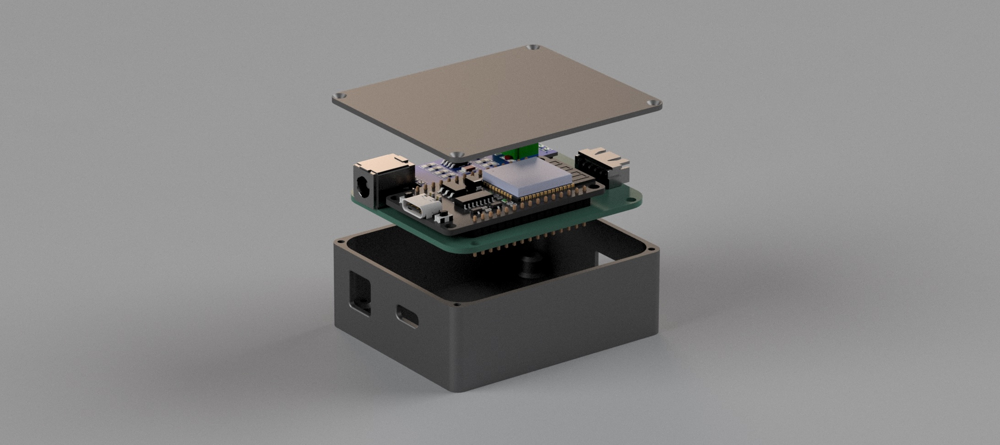
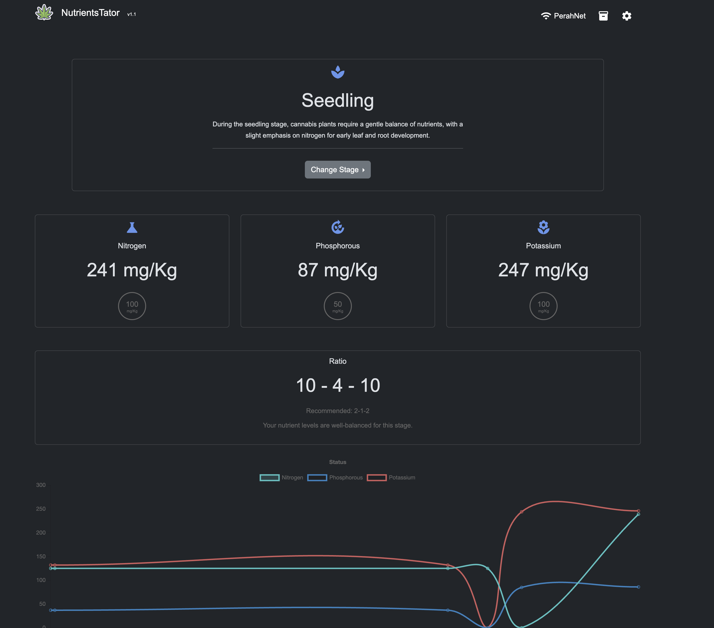

# smart_npk_sensor
Smart monitoring system for NPK in soil

Read more on the DIY build at: https://thebrightknight.github.io/

For detailed usage instructions visit - https://thebrightknight.github.io/npk_monitoring_system/2025/02/23/post1.html

  

  

#### License Note:

This project is licensed under the MIT License, but with the following restrictions:

No Redistribution: You are not allowed to redistribute or share the code in any form.
No Modification: You may not modify, alter, or build upon the project.
Non-Commercial Use Only: The project is for personal, non-commercial use only. Commercial use, including selling or distributing for profit, is prohibited.
By using this project, you agree to abide by these restrictions. Thank you for respecting the license terms!

